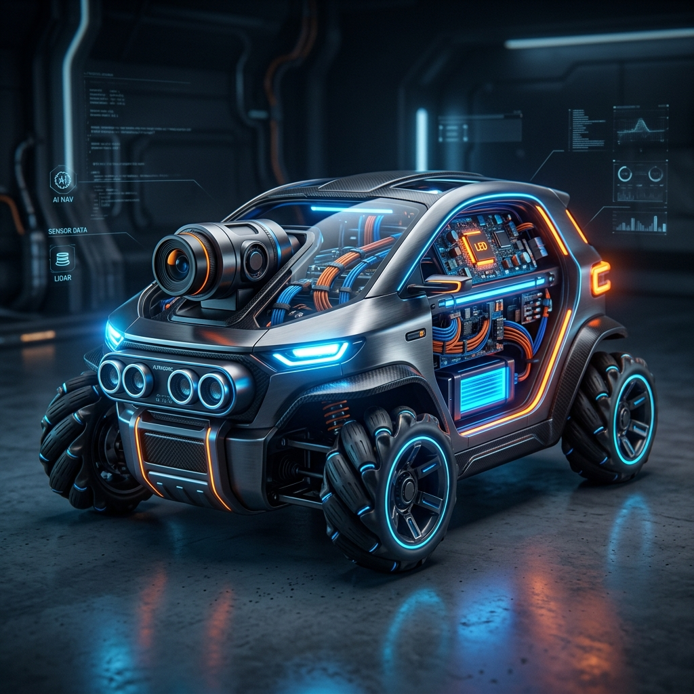
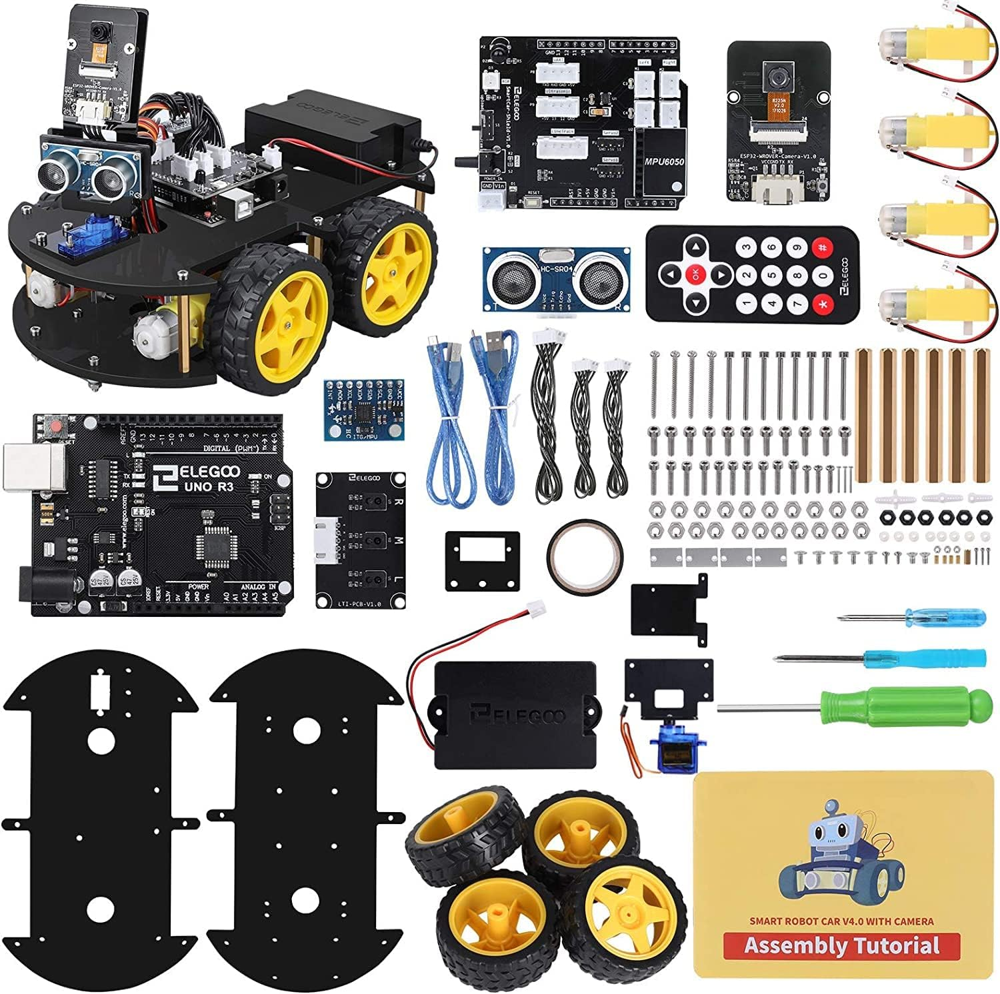

# Lezione 6: Sviluppo Assistito da IA (LLM) 🤖🧠

📥 **Materiale Didattico:** [Scarica le Slide — 2026 Autonomous AI (PDF)](../../docs/L6_slide_2026_Autonomous_AI.pdf)

Benvenuti alla **Lezione 6**! In questa sessione esploreremo come l'Intelligenza Artificiale, e in particolare i **Large Language Models (LLM)**, stiano rivoluzionando il modo in cui progettiamo, scriviamo e documentiamo il codice per la robotica. Non si tratta solo di "scrivere codice", ma di avere un partner intelligente che ci aiuta a risolvere problemi complessi in frazioni di secondo.

---

## 📖 Gli Argomenti della Lezione

*   **I Giganti dell'IA nel 2026**
    Panoramica sui modelli più influenti (ChatGPT, Claude, Gemini, DeepSeek, Llama) e le loro specificità nel coding.
*   **Prompt Engineering per la Robotica**
    Come parlare all'IA per ottenere algoritmi di controllo motori, gestione sensori e logiche di volo precise.
*   **Debugging Assistito**
    Utilizzare l'IA per analizzare errori di compilazione C++ e bug logici che i debugger tradizionali faticano a individuare.
*   **Strumenti Agentici e Automazione**
    Esplorazione di tool che non solo scrivono testo, ma interagiscono con i nostri file e cartelle di progetto.

---

## 🚀 I Leader del Mercato LLM (2026)

Ecco i 5 modelli linguistici più importanti e influenti emersi quest'anno, ciascuno con i suoi punti di forza specifici per uno sviluppatore:

| Modello | Ruolo Principale | Punto di Forza |
| :--- | :--- | :--- |
| **ChatGPT (OpenAI)** | La "Mothership" | Lo strumento più completo in assoluto per funzionalità generali e multimediali. |
| **Claude (Anthropic)** | Il Maestro di Scrittura | Insuperabile nella sintassi, sfumature linguistiche e programmazione avanzata (Claude Code). |
| **Gemini (Google)** | Il Potere Multimodale | Gestisce nativamente testi, immagini, audio e interi video. Integrato nell'ecosistema Google. |
| **DeepSeek** | L'Innovatore | Ha creato un vero "ribaltone" nel mercato, diventando un assistente quotidiano essenziale per l'analisi dati. |
| **Llama (Meta/Open Source)** | Controllo Totale | Fondamentale per chi cerca privacy e controllo, permettendo di far girare IA localmente (Ollama/Llama.cpp). |

---

## 🛠️ I 20 Strumenti IA più Potenti del 2026

Abbiamo selezionato gli strumenti più discussi che ogni studente di robotica dovrebbe conoscere.

### 📝 Categoria 1: Testo, Codice e Agenti
1.  **ChatGPT (Voice Mode)**: Partner ideale per il brainstorming e il problem-solving parlato naturale.
2.  **Claude (Claude Code/Cowork)**: Svolge task in autonomia direttamente sui file e cartelle del computer.
3.  **Perplexity & Comet**: L'incrocio perfetto tra ricerca web e IA; naviga e compila moduli al posto tuo.
4.  **Notion AI**: Il "secondo cervello" per organizzare documentazione e database di progetto.
5.  **NotebookLM**: Analizza paper scientifici e genera podcast riassuntivi dai tuoi documenti.
6.  **n8n / Make.com**: I giganti dell'automazione per connettere app (es. Telegram -> Google Sheets).
7.  **Whisper Flow**: Trascrizione offline perfetta per trasformare appunti vocali in prompt complessi.
8.  **Lovable.dev / Replit**: Generazione istantanea di app web e landing page da descrizioni testuali.
9.  **Manus (Meta)**: Agente IA ultra-veloce che coordina sub-agenti per task di ricerca estesi.
10. **OpenAI Codex**: Interfaccia desktop per delegare la creazione di software e l'uso di specifici framework.

### 🖼️ Categoria 2: Immagine e Design Visivo
11. **Nano Banana Pro (Gemini 3)**: Imbattibile per tipografia, infografiche e upscaling 4K.
12. **Midjourney**: Leader per qualità estetica, fotorealismo e simulazione di pellicole fotografiche.
13. **Ideogram**: Il miglior tool per integrare testo scritto perfettamente dentro le immagini.
14. **Flux 1**: Ideale per generazioni basate sul proprio volto (Avatar personalizzati).
15. **Higgsfield AI**: Funzionalità avanzate di "Relight" e angolazioni di ripresa per creativi.

### 🎬 Categoria 3: Video e Post-Produzione
16. **Google Flow (Veo 3.1)**: Creazione videoclip realistici modificabili tramite prompt.
17. **Cling AI**: Generatore video con lip-sync automatico perfetto dei personaggi.
18. **HeyGen**: Clonazione avatar e voce (ElevenLabs) per creare lezioni video senza telecamera.
19. **Minvo**: Analizza video lunghi e genera clip brevi (social) rimuovendo pause e aggiungendo sottotitoli.
20. **Tell**: Edita video tutorial e registrazioni schermo in pochi clic grazie all'IA.

---

## 💡 Prompt Engineering per la Robotica

Scrivere un prompt efficace è come dare istruzioni precise a un programmatore junior molto veloce. 

> **❌ Prompt Inefficace:** "Scrivi il codice per un robot che evita ostacoli con Arduino."
> 
> **✅ Prompt Efficace:** "Agisci come un esperto programmatore C++ per Arduino. Scrivi uno sketch per un robot con sensore ultrasuoni HC-SR04 collegato ai pin 10 (Trig) e 11 (Echo). Se la distanza è < 20cm, il robot deve fermarsi, girare a destra per 500ms e poi ripartire. Usa i pin 5,6 per il motore sinistro e 7,8 per il destro. Commenta ogni riga e ottimizza per evitare l'uso di `delay()`."

### Consigli d'Oro per la Robotica:
1.  **Definisci il Ruolo**: Inizia con "Comportati come un ingegnere robotico..."
2.  **Specifica l'Hardware**: Elenca pin, sensori e librerie (es. `Servo.h`).
3.  **Descrivi la Logica**: Usa termini come "Stato del sistema", "Loop di controllo", "Filtro dei dati".
4.  **Chiedi Spiegazioni**: "Spiegami perché hai scelto questa logica di controllo" per imparare durante il processo.

---

## 🔍 Debugging Intelligente con l'IA

Quando il compilatore ti dà errore, non disperare. L'IA è il tuo miglior alleato:

1.  **Copia l'Errore**: Incolla l'intero output di errore dell'Arduino IDE nel prompt.
2.  **Fornisci il Contesto**: Incolla anche il tuo codice (`.ino`).
3.  **Chiedi l'Analisi**: "Perché ricevo l'errore 'expected primary-expression before token'? Controlla la sintassi del mio loop `if`."
4.  **Logica, non solo sintassi**: "Il codice compila ma il motore non gira. Può esserci un conflitto di timer tra la libreria `Servo.h` e il PWM dei motori?"

---

## 🎥 Video della Lezione

Guarda la video-guida dedicata all'uso dell'IA nella robotica per approfondire i concetti di questa lezione:

*Clicca sull'immagine sopra per avviare il caricamento del video su YouTube.*

---

## 🧐 FAQ — Domande Frequenti

### L'IA sostituirà il programmatore?
No. L'IA è un **moltiplicatore di produttività**. Chi sa usare l'IA scriverà codice 10 volte più velocemente, ma la supervisione umana è fondamentale per la sicurezza e la coerenza logica (specialmente in robotica dove ci sono pesi e inerzie reali).

### Posso fidarmi del codice generato al 100%?
**Mai.** Verifica sempre i collegamenti dei pin e testa i movimenti meccanici con cautela (es. tieni il robot sollevato da terra durante il primo test del codice generato).

### Quale modello è meglio per Arduino?
Al momento **Claude 3.5 Sonnet** e **GPT-4o/o1** sono considerati i migliori per generare codice C++ privo di errori logici e ben commentato.

---

## 🚀 Progetto Speciale: ELEGOO Smart Car V4.0 (Fase 1)

In questa prima fase del progetto speciale, inizieremo l'assemblaggio del kit **ELEGOO Smart Robot Car V4.0**. L'obiettivo di oggi è completare la parte meccanica e verificare che i motori rispondano correttamente ai comandi base.

### 📋 Checklist di Oggi:
1.  **Identificazione Componenti**: Verifica di avere lo chassis, i 4 motori DC, la scheda madre (ELEGOO Uno) e il pacco batterie (vedi immagine sopra).
2.  **Montaggio Meccanico**: Fissaggio dei motori al telaio e installazione delle ruote.
3.  **Cablaggio Base**: Collegamento dei motori alla scheda di controllo.
4.  **Test di Movimento**: Caricamento dello sketch di test per verificare che il robot vada avanti, indietro e curvi.

### 🔭 Uno sguardo al futuro (Fase 2 e 3):
Nelle prossime lezioni implementeremo la navigazione autonoma e la visione artificiale:

| Navigazione Autonoma (Fase 2) | Visione Artificiale (Fase 3) |
| :---: | :---: |
|  |  |

### 📚 Risorse per il Kit:
*   **Manuale di Assemblaggio PDF**: Disponibile nel [Sito Ufficiale ELEGOO](https://www.elegoo.com/blogs/arduino-projects/elegoo-smart-robot-car-kit-v4-0-tutorial).
*   **Video Tutorial Montaggio**: [Guarda su YouTube](https://www.youtube.com/watch?v=n8n_KjpMfVT0) (Esempio V4.0).
*   **Librerie Necessarie**: Ricordati di installare le librerie fornite nel kit tramite `Sketch -> Include Library -> Add .ZIP Library`.

> **⚠️ Attenzione**: Assicurati che lo switch sulla scheda sia in posizione **"Upload"** durante il caricamento del codice e in **"Run"** per l'esecuzione.

---

## 🗺️ Navigazione
*   [Torna alla Home](../../README.md)
*   [Lezione Precedente: Robotica Mobile e Attuatori](../lezione_5/README.md)
*   [Prossima Lezione: Robotica Sociale e Interazione](../lezione_7/README.md)

---

*“L'intelligenza artificiale non scriverà il tuo robot, ma ti darà i superpoteri per costruirlo meglio.”*
