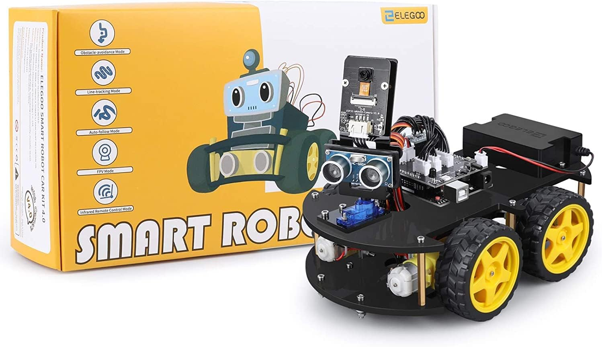
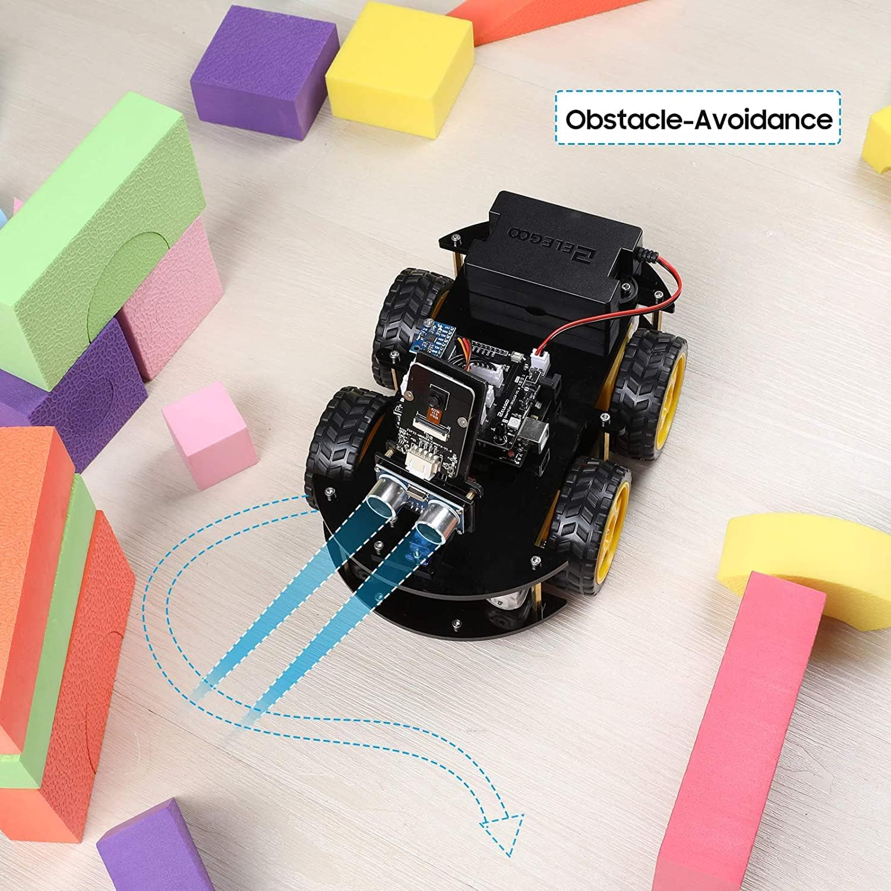
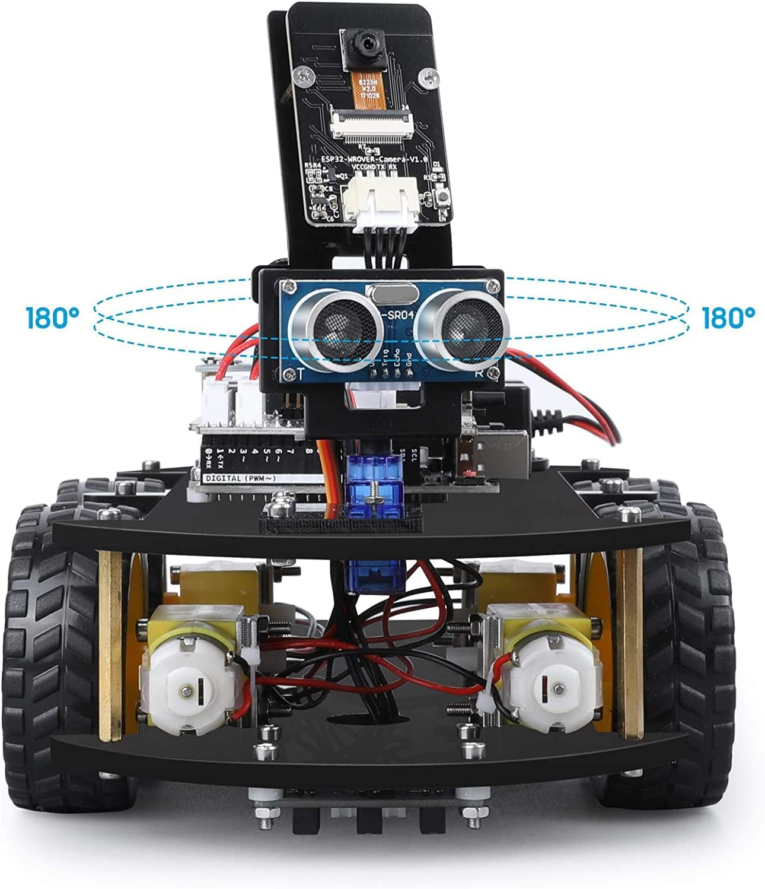

# 🚀 Progetto Speciale: ELEGOO Smart Robot Car V4.0

Benvenuti alla pagina dedicata al **Progetto Speciale del Corso**! 🤖🧠 
In parallelo alle lezioni teoriche, questo progetto pratico vi porterà a costruire, programmare e testare un robot avanzato dotato di sensori e visione artificiale.

---

## 📖 Panoramica del Progetto

Utilizzeremo il kit **ELEGOO Smart Car V4.0**, una piattaforma robotica basata su Arduino UNO, equipaggiata con:
*   **Modulo ESP32 Camera**: Per lo streaming video in tempo reale (FPV).
*   **Sensori Ultrasuoni e Line Tracking**: Per la navigazione autonoma.
*   **Controllo via App**: Pilotaggio tramite smartphone o tablet via Bluetooth/WiFi.

---

## 🗺️ Le 3 Fasi del Progetto

Il progetto è suddiviso in tre macro-obiettivi, integrati nelle Lezioni 6, 7 e 8:

### 🧩 [Fase 1: Assemblaggio e Test Movimento (Lezione 6)](../lezione_6/README.md#progetto-speciale-elegoo-smart-car-v40-fase-1)
*   **Obiettivo**: Completare la struttura meccanica del robot.
*   **Attività**: Montaggio chassis, motori e driver; test di movimento base (avanti/dietro/svolta).
*   **Risorse**: [Manuale di Assemblaggio V4.0](https://www.elegoo.com/blogs/arduino-projects/elegoo-smart-robot-car-kit-v4-0-tutorial).

### 🤖 [Fase 2: Navigazione Autonoma (Lezione 7)](../lezione_7/README.md)
*   **Obiettivo**: Rendere il robot "intelligente".
*   **Attività**: Completamento montaggio kit, cablaggio sensori e implementazione algoritmi *Obstacle Avoidance* (sensore ultrasuoni HC-SR04) e *Line Tracking* (moduli infrarossi).
*   **Hardware**: 

### 📸 [Fase 3: Visione Artificiale e Feedback (Lezione 8)](../lezione_8/README.md)
*   **Obiettivo**: Guida in soggettiva e interazione multimediale.
*   **Attività**: Programmazione del modulo ESP32 Camera, streaming video WiFi e integrazione di Feedback Visivo/Sonoro (OLED e Buzzer) per simulare emozioni.
*   

---

## 🏆 Gran Finale: Il Robot Show (Lezione 10)

Il corso si concluderà con una presentazione pubblica dei vostri modelli. Ogni robot dovrà superare un percorso ad ostacoli o eseguire una coreografia coordinata tramite IA.

---

## 🛠️ Risorse e Download

*   📑 **Manuali Ufficiali**: [Archivio Tutorial ELEGOO](https://www.elegoo.com/blogs/arduino-projects/elegoo-smart-robot-car-kit-v4-0-tutorial)
*   📦 **Librerie Arduino**: Ricordati di importare i file `.zip` contenuti nella cartella `Library` del pacchetto tutorial.
*   📱 **App di Controllo**: Cerca "Elegoo BLE Tool" su Google Play o App Store.

---

## 🗺️ Navigazione
*   [Torna alla Home Page](../../README.md)
*   [Vai alla Lezione Attuale (Fase 1)](../lezione_6/README.md)

---
*“L'ingegneria non è solo progettare, è vedere le proprie idee prendere vita.”*
